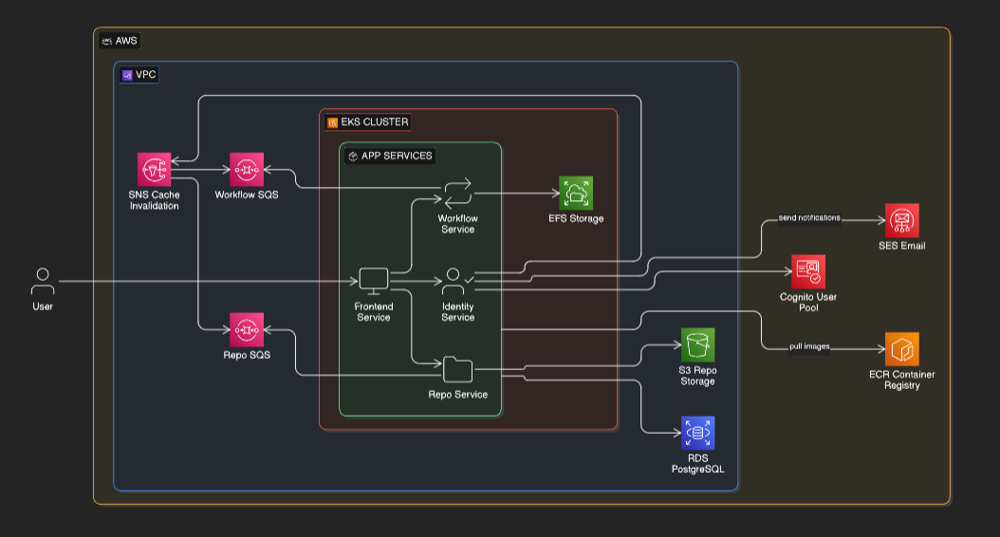
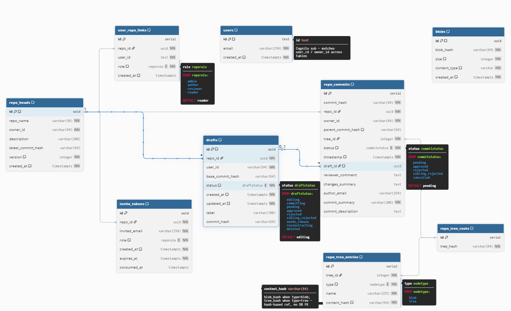

# nekvorepo

> A cloud-native, web-based version control platform built on AWS — bringing repository management, role-based collaboration, and a full commit-review workflow to the browser.

<p align="center">
  <em>Built with FastAPI · Next.js · PostgreSQL · AWS (EKS, S3, EFS, Cognito, CloudFront, SQS, SES, Lambda)</em>
</p>

<!-- <project_banner_GIF> -->

---

## Table of Contents

- [Overview](#overview)
- [Key Concepts](#key-concepts)
- [Architecture](#architecture)
- [Database Schema](#database-schema)
- [Microservices](#microservices)
- [Tech Stack](#tech-stack)
- [Repository Layout](#repository-layout)
- [Requirements](#requirements)
- [Local Installation](#local-installation)
- [Usage](#usage)
- [Configuration](#configuration)
- [Deployment](#deployment)
- [Testing](#testing)
- [Observability & Reliability](#observability--reliability)
- [Security](#security)
- [Contributing](#contributing)
- [License](#license)

---

## Overview

**nekvorepo** is a cloud-native version control system delivered entirely through a web browser. Users create repositories, invite collaborators, edit files in an in-browser IDE, propose commits, and route them through a structured review workflow — all without ever touching a `git` CLI.

The platform is designed around a content-addressed storage model (SHA-256 trees and blobs), an explicit **draft → commit → review** state machine, and a strict role-based permission model. The infrastructure is fully defined in Terraform and runs on AWS EKS with auto-scaling, blue/green deployments, and event-driven background workers.

<!-- <product_demo_GIF> -->

### Why nekvorepo?

- **Browser-native VCS** — no local clones, no CLI, no merge conflicts left to chance.
- **Structured review** — every change is a proposed commit that an authorized reviewer must approve or reject before it becomes part of history.
- **Conflict resolution in the UI** — a five-category rebase screen surfaces every conflict (text, binary, type collisions, deletions) with side-by-side panels.
- **Cloud-native by design** — content-addressed S3 storage, EFS-backed drafts, Cognito-backed identity, and KEDA-scaled SQS workers.

---

## Key Concepts

| Concept | Description |
| --- | --- |
| **Repository** | A named container of files owned by a user. Members are assigned exactly one role per repo. |
| **Role** | One of `Reader`, `Author`, `Reviewer`, `Admin`. Each role has a dedicated UI; no role sees controls that don't belong to it. |
| **Draft** | An author's in-progress workspace, backed by an isolated EFS directory. Multiple drafts per author per repo are supported. |
| **Commit** | A frozen, content-addressed snapshot proposed for review. Status transitions: `pending → approved / rejected / sibling_rejected / cancelled`. |
| **Tree / Blob** | Content-addressed objects (SHA-256). Trees are deduplicated across repos; blobs are global. |
| **Rebase Flow** | A pre-commit conflict resolution screen triggered when the approved head moves while a draft is being edited. |
| **Sibling Rejection** | When two drafts share a parent and one is approved first, the other is automatically marked `sibling_rejected` and routed to conflict resolution. |
| **Invite** | A 72-hour single-use UUID token sent via SES; supports invitations to existing or unregistered emails. |

---

## Architecture

The system is split into three FastAPI microservices behind an ALB, a Next.js frontend, and a set of supporting AWS services. The ALB routes by non-overlapping path prefix; pods talk to each other over HTTPS within the cluster.



**High-level flow:**


### Routing

| Path prefix | Service |
| --- | --- |
| `/v1/auth/*`, `/v1/invites/*`, `/v1/users/*` | identity-service |
| `/v1/repos/*/drafts/*`, `/v1/repos/*/files/*`, `/v1/repos/*/view`, `/v1/repos/*/head`, `/v1/repos/*/conflicts`, `/v1/repos/*/archive`, `/v1/repos/*/tasks/*` | repo-service |
| `/v1/repos/create`, `/v1/repos/*/commits`, `/v1/repos/*/history`, `/v1/commits/*`, `DELETE /v1/repos/*`, `DELETE /v1/repos/*/members/*` | workflow-service |
| `/v1/internal/*` | cluster-only (NetworkPolicy enforced) |

---

## Database Schema

The relational schema is normalized around content-addressed objects. Trees and blobs are deduplicated; commits reference trees via a hash chain.



| Table | Purpose |
| --- | --- |
| **1. User-Repo Associations** | `(user_id, repo_id, role)` — the source of truth for permissions. |
| **2. Repository Metadata** | `repo_id`, `repo_name`, `owner_id`, `latest_commit_hash`, `version` (optimistic lock). |
| **3. Trees** | `tree_hash` (SHA-256 of canonical serialisation). |
| **4. Tree-Object Associations** | Edges from a tree to its child blobs/subtrees. |
| **5. Commits** | `commit_hash`, `parent_commit_hash`, `tree_id`, `status`, `reviewer_comment`. |
| **6. Blobs** | `content_hash` (= S3 object key), `size_bytes`, `mime_type`. Never deleted. |
| **7. Invite Tokens** | UUID tokens with 72-hour TTL, `consumed_at`. |
| **8. Drafts** | The in-progress state machine (`editing`, `committing`, `pending`, `needs_rebase`, `reconstructing`, `approved`, `rejected`, `sibling_rejected`, `deleted`). |

Ephemeral task state (archive generation, EFS reconstruction) lives in **DynamoDB** with a 24-hour TTL.

---

## Microservices

### `identity-service` — The Gatekeeper
The authoritative source for user identity and repository permissions. Bridges to AWS Cognito, issues JWTs, manages the invite lifecycle, and exposes internal role lookups consumed (and cached for 60 seconds) by the other services.

Key endpoints: `POST /v1/auth/{register,login,refresh}`, `POST /v1/repos/{id}/invites`, `POST /v1/invites/accept/{token}`, internal `GET /v1/internal/repos/{id}/role`.

### `repo-service` — The IO Hub
Manages the full lifecycle of draft files in EFS, serves committed content from S3 via CloudFront signed URLs, and runs conflict classification for the rebase flow.

Key endpoints: `POST /v1/repos/{id}/drafts`, `POST /v1/repos/{id}/drafts/{draft_id}/save`, `POST /v1/repos/{id}/drafts/{draft_id}/upload`, `POST /v1/repos/{id}/conflicts`, `GET /v1/repos/{id}/files/{path}?ref=...`, `GET /v1/repos/{id}/archive`.

### `workflow-service` — The Logic Engine
The Git state machine. Owns the atomic approval transaction, sibling-rejection cascade, stale-draft invalidation (`SKIP LOCKED`), and the 5-minute background sweep for deadlock recovery.

Key endpoints: `POST /v1/repos/create`, `POST /v1/repos/{id}/commits`, `POST /v1/commits/{hash}/{approve,reject}`, `GET /v1/commits/{hash}/diff`, `GET /v1/repos/{id}/history`.

<!-- <commit_review_GIF> -->

---

## Tech Stack

**Backend**
- Python 3.13, FastAPI, SQLAlchemy 2.0 (async), SQLModel, Pydantic v2
- Alembic for migrations
- `boto3`, `httpx`, `tenacity`, `structlog`, `pyjwt` + `cryptography`
- `uv` for dependency management

**Frontend**
- Next.js 16, React 19, TypeScript 5
- Tailwind CSS 4, lucide-react

**Data & Infrastructure**
- PostgreSQL (RDS Multi-AZ, RDS Proxy), DynamoDB, S3, EFS
- AWS Cognito, CloudFront (OAC), SQS (with DLQs), SES, Lambda, KMS, WAF, Secrets Manager
- AWS EKS on Graviton3, Karpenter, KEDA, External Secrets Operator
- Terraform for all infrastructure-as-code
- Docker / docker-compose for local development

---

## Repository Layout

```
nekvorepo/
├── services/
│   ├── identity-service/       # FastAPI — auth, invites, role source of truth
│   ├── repo-service/           # FastAPI — drafts, files, conflicts, archives
│   ├── workflow-service/       # FastAPI — commits, approvals, history
│   ├── database-migrations/    # Alembic migrations + per-service role bootstrap
│   └── shared/                 # Shared models, schemas, security, SQS consumer
├── frontend/                   # Next.js app (App Router)
├── terraform/                  # All AWS IaC (VPC, EKS, RDS, S3, Cognito, ...)
├── k8s/base/                   # Kustomize base manifests for EKS
├── docs/                       # Versioned project definitions
├── scripts/                    # sync-env.sh and other helpers
├── data/efs/                   # Local bind-mount substitute for EFS
└── docker-compose.yml          # One-shot local stack
```

---

## Requirements

- **Docker** & **Docker Compose** v2.20+
- **Python** 3.13 (only required for running services outside Docker)
- **Node.js** 20+ and **npm** 10+ (only for frontend dev outside Docker)
- **AWS account** with credentials configured — the local stack still talks to real AWS resources for S3, Cognito, SES, SQS
- **Terraform** 1.6+ and **kubectl** 1.29+ (for cloud deployment only)

---

## Local Installation

> The local stack uses Docker for every service and a host bind-mount in place of EFS. RDS, S3, Cognito, SES, and SQS are real AWS resources — set them up via the Terraform stack first, or point at an existing dev environment.

**1. Clone and configure environment**

```bash
git clone https://github.com/<your-org>/nekvorepo.git
cd nekvorepo
cp .env.example .env       # fill in AWS creds, Cognito IDs, S3 bucket, queue URLs, ...
```

**2. Bring up the stack**

```bash
docker compose up --build
```

The compose file orchestrates:

1. `database-migrations` — runs Alembic, then exits.
2. `init-db-roles` — creates per-service least-privilege Postgres users.
3. `identity-service` (`:8001`), `workflow-service` (`:8002`), `repo-service` (`:8003`).
4. `frontend` (`:3000`) — production Next.js build, hardened with `read_only`, `no-new-privileges`, `tmpfs /tmp`.

**3. Open the app**

Visit [http://localhost:3000](http://localhost:3000), register a user, and create your first repository.

<!-- <local_setup_GIF> -->

---

## Usage

A whirlwind tour through each role:

### As an **Author**

1. Click **+ New Draft** in the left panel of a repo.
2. Edit files in the embedded IDE (auto-save kicks in after 2 seconds of inactivity).
3. Upload binary files up to 100 MB, create folders, rename, delete.
4. When ready, click **Commit** to propose your changes for review.
5. If the approved head moves while you're editing, your draft enters **Needs Rebase** — click **Resolve & Rebase** to walk through the five-category conflict screen.

### As a **Reviewer**

1. Open the **Pending Commits Queue**, sorted oldest first.
2. Click **View Diff** to see a full file-by-file diff against the commit's parent.
3. **Approve** runs the atomic 8-step transaction (sibling rejections, head update, stale-draft invalidation), then publishes SQS notifications.
4. **Reject** captures a required comment and emails the author.

### As an **Admin**

The Admin gets all Author + Reviewer powers, plus a **Manage** tab:
- Invite members (any of the four roles, including a second Admin)
- Change roles (with confirmation of consequences)
- Remove members (cancels their pending commits, fires immediate SQS cache invalidation)
- Delete the repository (full cascade across Tables 1, 2, 3, 4, 5, 7, 8)

<!-- <admin_management_GIF> -->

### As a **Reader**

A read-only view of the latest approved head — no history, no drafts, no commit panel. ZIP archive download is available via an async Lambda task.

---

## Configuration

All services read configuration from environment variables (12-factor). The most important keys:

| Variable | Description |
| --- | --- |
| `DATABASE_URL` / `IDENTITY_DATABASE_URL` / `REPO_DATABASE_URL` / `WORKFLOW_DATABASE_URL` | Postgres connection strings (per-service users in production). |
| `AWS_REGION`, `AWS_ACCESS_KEY_ID`, `AWS_SECRET_ACCESS_KEY` | AWS credentials (use IRSA in production — no static creds in pods). |
| `S3_REPO_BUCKET` | Bucket holding content-addressed blobs and temporary archive ZIPs. |
| `COGNITO_USER_POOL_ID`, `COGNITO_CLIENT_ID` | Cognito User Pool used for auth. |
| `SES_FROM_EMAIL`, `SES_CONFIGURATION_SET_NAME` | Verified sender for invite/notification emails. |
| `WORKFLOW_CACHE_INVALIDATION_QUEUE_URL`, `REPO_CACHE_INVALIDATION_QUEUE_URL` | Per-service SQS queues for immediate role-cache eviction. |
| `SNS_CACHE_INVALIDATION_TOPIC_ARN` | Fan-out topic published to by identity-service. |
| `INVITE_ACCEPT_BASE_URL` | Public URL embedded in invite emails. |

In production, secrets are stored in **AWS Secrets Manager** and projected into pods via the **External Secrets Operator** (`k8s/base/externalsecrets.yaml`).

A helper script `scripts/sync-env.sh` keeps the local `.env` aligned with values pulled from a configured remote source.

---

## Deployment

Production runs on **AWS EKS (Graviton3)** behind an ALB, with everything provisioned by Terraform.

### Provisioning the AWS environment

```bash
cd terraform
terraform init
terraform plan
terraform apply
```

The Terraform configuration covers:

- VPC, private/public subnets, security groups
- EKS cluster, IAM roles for service accounts (IRSA), pod identity
- RDS (Multi-AZ Postgres) + RDS Proxy, KMS-encrypted
- S3 (versioned, intelligent tiering, lifecycle for archives)
- EFS with elastic throughput and IA lifecycle
- Cognito User Pool + client
- SQS queues with DLQs, SES configuration, ECR repositories
- Helm releases for ALB Controller, External Secrets, Karpenter, KEDA

### Deploying workloads to EKS

```bash
kubectl apply -k k8s/base
```

Manifests in `k8s/base/` cover Deployments, Services, the Ingress, NetworkPolicies, PodDisruptionBudgets, ServiceAccounts, ExternalSecrets, the EFS PV, and one-shot Jobs for migrations and role bootstrap. HPA targets 70% CPU on each microservice with a minimum of 1 replica.

### CI/CD

GitHub Actions runs three workflows:
1. **Lint & test** on every PR.
2. **Build → ECR → deploy to staging** on merge to `main`.
3. **Promote staging → production** after staging health checks pass for 5 continuous minutes.

Migrations run as a Kubernetes Job before new pods deploy and are required to be backward-compatible with the previous release.

---

## Testing

Each service has an integration-first test suite using `pytest` and `testcontainers[postgres]` — tests spin up a real Postgres instance, never mocks.

```bash
cd services/identity-service
uv sync --group test
uv run pytest

# repeat for repo-service and workflow-service
```

Frontend lint:

```bash
cd frontend
npm run lint
```

---

## Observability & Reliability

- **Structured JSON logs** with request correlation IDs propagated across service hops.
- **AWS X-Ray** distributed tracing with reservoir sampling (5 rps fixed + 5% of remainder).
- **CloudWatch Alarms** on p99 latency > 2s, error rate > 1%, any DLQ depth > 0, RDS CPU > 80%.
- **SLO**: 99.9% monthly uptime; SLO breach triggers a mandatory post-incident review.
- **Health checks**: every service exposes `GET /ping` (liveness) and `GET /health` (readiness, checks RDS / EFS / Cognito JWKS).
- **Deadlock recovery**: a 5-minute Workflow-Service sweep uses `SELECT ... FOR UPDATE SKIP LOCKED` to recover stuck `committing` / `reconstructing` drafts.

---

## Security

- AWS Cognito for identity; JWT validated on every request via JWKS (24-hour cache, immediate invalidation on unknown `kid`).
- Per-service least-privilege Postgres users (`identity_svc_user`, `repo_svc_user`, `workflow_svc_user`).
- Pods run as non-root, with read-only root filesystem, no privilege escalation, and distroless/minimal base images.
- WAF on both the ALB and CloudFront (Core Rule Set, Known Bad Inputs, SQLi managed rules; per-IP rate limits).
- TLS 1.2+ enforced everywhere (TLS 1.0/1.1 explicitly disabled). HTTPS even for in-cluster calls.
- Secrets in **AWS Secrets Manager** with rotation enabled; never in env files committed to git.
- S3, EFS, and RDS encrypted at rest. CloudFront signed URLs (15-minute TTL) are always re-fetched on click — never pre-cached.
- PII (email addresses) is never logged — replaced with hashed identifiers for correlation.

---

## Contributing

Contributions are welcome. Please:

1. Open an issue describing the change before sending a large PR.
2. Follow the existing code style (`ruff` for Python, ESLint for TS).
3. Add or update integration tests — this project's policy is **tests before implementation**.
4. Keep migrations additive and backward-compatible with the previous release.
5. Never bypass pre-commit hooks (`--no-verify`) or skip CI; fix the underlying issue instead.

---

## License

This project is released under the MIT License. See [`LICENSE`](LICENSE) for details.
